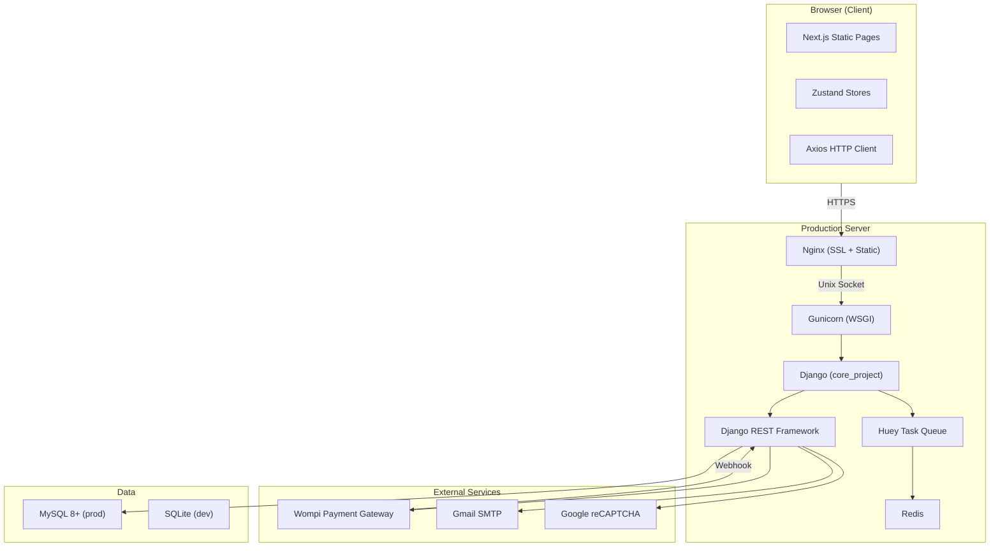
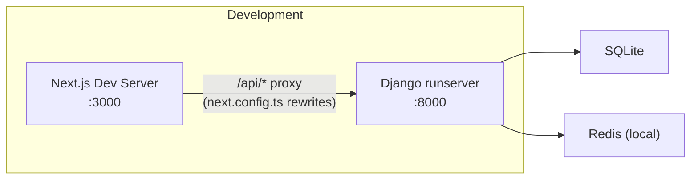
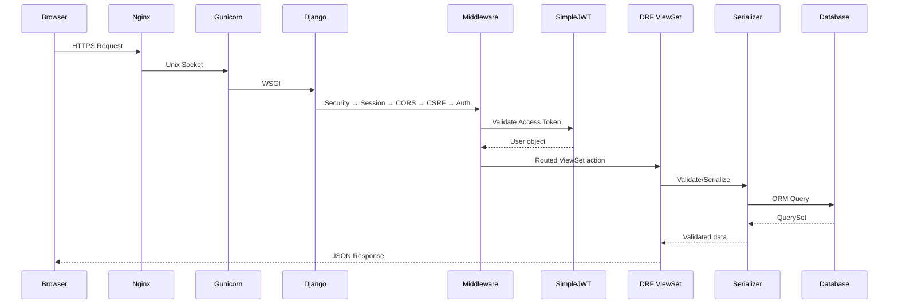
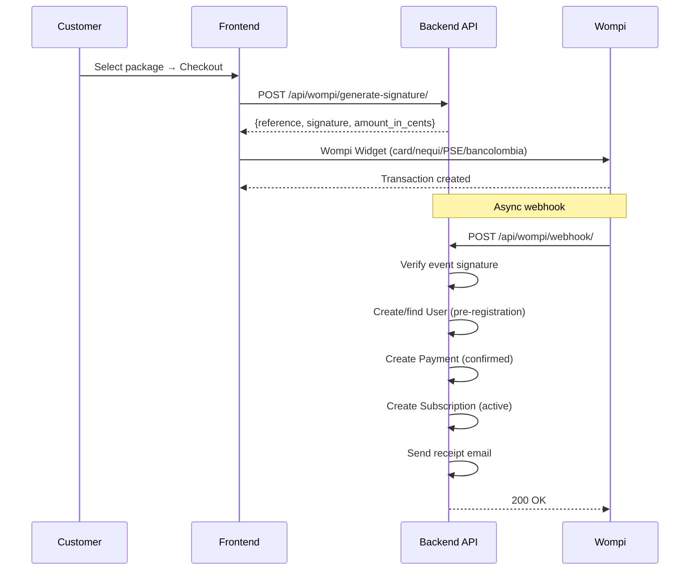
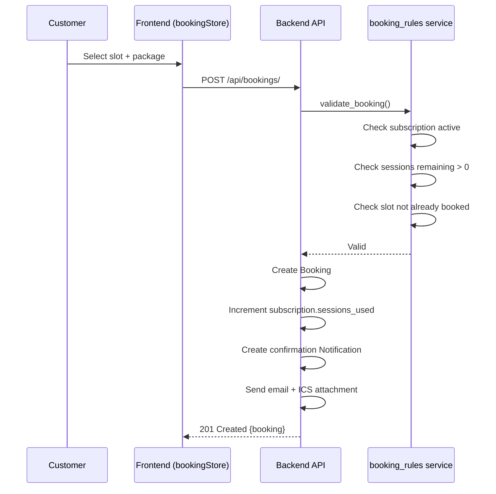
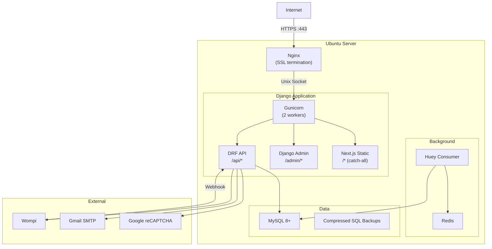

# Architecture Documentation — KÓRE

## 1. System Overview

---

## 2. Development Architecture

In development:
- Next.js runs on port 3000 with API proxy to Django on port 8000
- SQLite database, no MySQL required
- Huey can run in immediate mode (`HUEY_IMMEDIATE=true`) for synchronous task execution

---

## 3. Request Flow

### 3.1 API Request

### 3.2 Payment Flow (Wompi)

### 3.3 Booking Flow

---

## 4. Entity Relationship Diagram

```mermaid
erDiagram
    User ||--o| TrainerProfile : "1:1 (role=trainer)"
    User ||--o| CustomerProfile : "1:1 (role=customer)"
    User ||--o{ Subscription : "has many"
    User ||--o{ Booking : "has many (as customer)"
    User ||--o{ Payment : "has many"
    User ||--o{ PaymentIntent : "has many"
    User ||--o{ AnalyticsEvent : "has many (optional)"
    User ||--o{ MoodEntry : "has many"
    User ||--o{ WeightEntry : "has many"
    User ||--o{ PasswordResetCode : "has many"
    User ||--o{ TermsAcceptance : "has many"
    User ||--o{ AnthropometryEvaluation : "has many (as customer)"
    User ||--o{ PosturometryEvaluation : "has many (as customer)"
    User ||--o{ PhysicalEvaluation : "has many (as customer)"
    User ||--o{ NutritionHabit : "has many (as customer)"
    User ||--o{ ParqAssessment : "has many (as customer)"

    Package ||--o{ Subscription : "has many"
    Package ||--o{ Booking : "has many"
    Package ||--o{ PaymentIntent : "has many"

    Subscription ||--o{ Booking : "has many"
    Subscription ||--o{ Payment : "has many"

    TrainerProfile ||--o{ AvailabilitySlot : "has many"
    TrainerProfile ||--o{ Booking : "has many"
    TrainerProfile ||--o{ AnthropometryEvaluation : "has many"
    TrainerProfile ||--o{ PosturometryEvaluation : "has many"
    TrainerProfile ||--o{ PhysicalEvaluation : "has many"

    AvailabilitySlot ||--o{ Booking : "has many"

    Booking ||--o{ Payment : "has many"
    Booking ||--o{ Notification : "has many"

    Payment ||--o{ Notification : "has many"

    FAQCategory ||--o{ FAQItem : "has many"

    User {
        int id PK
        string email UK
        string first_name
        string last_name
        string phone
        enum role "customer|trainer|admin"
        bool is_active
        bool is_staff
        datetime date_joined
    }

    TrainerProfile {
        int id PK
        int user_id FK
        string specialty
        text bio
        string location
        int session_duration_minutes
    }

    CustomerProfile {
        int id PK
        int user_id FK
        string avatar
        enum sex "masculino|femenino|otro|prefiero_no_decir"
        date date_of_birth
        string eps
        enum id_type "ti|cc|ce|pasaporte|dni"
        string id_number
        date id_expedition_date
        string address
        string city
        enum primary_goal "fat_loss|muscle_gain|rehab|general_health|sports_performance"
        date kore_start_date
        bool profile_completed
    }

    Package {
        int id PK
        string title
        string short_description
        text description
        enum category "personalizado|semi_personalizado|terapeutico"
        int sessions_count
        int session_duration_minutes
        decimal price
        string currency
        int validity_days
        text terms_and_conditions
        bool is_active
        int order
    }

    Subscription {
        int id PK
        int customer_id FK
        int package_id FK
        int sessions_total
        int sessions_used
        enum status "active|expired|canceled"
        datetime starts_at
        datetime expires_at
        string payment_source_id
        string payment_method_type
        bool is_recurring
        string wompi_transaction_id
        date next_billing_date
        datetime expiry_email_sent_at
        datetime expiry_ui_sent_at
    }

    AvailabilitySlot {
        int id PK
        int trainer_id FK
        datetime starts_at
        datetime ends_at
        bool is_active
        bool is_blocked
        string blocked_reason
    }

    Booking {
        int id PK
        int customer_id FK
        int package_id FK
        int slot_id FK
        int trainer_id FK
        int subscription_id FK
        enum status "pending|confirmed|canceled"
        text notes
        string canceled_reason
    }

    Payment {
        int id PK
        int booking_id FK
        int subscription_id FK
        int customer_id FK
        enum status "pending|confirmed|failed|canceled|refunded"
        decimal amount
        string currency
        enum provider "wompi|payu|epayco|paypal"
        string provider_reference
        json metadata
        datetime confirmed_at
    }

    PaymentIntent {
        int id PK
        int customer_id FK
        int package_id FK
        string reference UK
        string wompi_transaction_id
        string payment_source_id
        decimal amount
        string currency
        string pending_email
        string pending_first_name
        string pending_last_name
        string pending_phone
        string pending_password_hash
        string public_access_token
        enum status "pending|approved|failed"
    }

    Notification {
        int id PK
        int booking_id FK
        int payment_id FK
        enum notification_type
        enum status "pending|sent|failed"
        string sent_to
        string provider_message_id
        json payload
        text error_message
    }

    AnalyticsEvent {
        int id PK
        int user_id FK
        string event_type
        string session_id
        string path
        string referrer
        json metadata
    }

    AnthropometryEvaluation {
        int id PK
        int customer_id FK
        int trainer_id FK
        date evaluation_date
        decimal weight_kg
        decimal height_cm
        decimal waist_cm
        decimal hip_cm
        json perimeters
        json skinfolds
        text notes
        json recommendations
        decimal bmi
        string bmi_category
        decimal waist_hip_ratio
        decimal body_fat_pct
        decimal fat_mass_kg
        decimal lean_mass_kg
        json asymmetries
    }

    PosturometryEvaluation {
        int id PK
        int customer_id FK
        int trainer_id FK
        date evaluation_date
        json anterior_data
        json lateral_right_data
        json lateral_left_data
        json posterior_data
        image anterior_photo
        image lateral_right_photo
        image lateral_left_photo
        image posterior_photo
        text notes
        json recommendations
        decimal global_index
        decimal upper_index
        decimal central_index
        decimal lower_index
        json segment_scores
        json findings
    }

    PhysicalEvaluation {
        int id PK
        int customer_id FK
        int trainer_id FK
        date evaluation_date
        int squats_reps
        int pushups_reps
        int plank_seconds
        int walk_meters
        int unipodal_seconds
        int hip_mobility
        int shoulder_mobility
        int ankle_mobility
        text notes
        json recommendations
        decimal strength_index
        decimal endurance_index
        decimal mobility_index
        decimal balance_index
        decimal general_index
        json cross_module_alerts
    }

    NutritionHabit {
        int id PK
        int customer_id FK
        int meals_per_day
        decimal water_liters
        int fruit_weekly
        int vegetable_weekly
        int protein_frequency
        int ultraprocessed_weekly
        int sugary_drinks_weekly
        bool eats_breakfast
        text notes
        decimal habit_score
        string habit_category
    }

    ParqAssessment {
        int id PK
        int customer_id FK
        bool q1_heart_condition
        bool q2_chest_pain
        bool q3_dizziness
        bool q4_chronic_condition
        bool q5_prescribed_medication
        bool q6_bone_joint_problem
        bool q7_medical_supervision
        text additional_notes
        int yes_count
        string risk_classification
    }

    MoodEntry {
        int id PK
        int user_id FK
        int score
        text notes
        date date
    }

    WeightEntry {
        int id PK
        int user_id FK
        decimal weight_kg
        date date
    }

    PasswordResetCode {
        int id PK
        int user_id FK
        string code
        datetime expires_at
        bool used
    }

    TermsAcceptance {
        int id PK
        int user_id FK
        string terms_version
        string ip_address
        text user_agent
        datetime accepted_at
    }

    SiteSettings {
        int id PK
        string company_name
        string email
        string phone
        string whatsapp
        string address
        string city
        string business_hours
        string instagram_url
        string facebook_url
        string footer_text
    }

    FAQCategory {
        int id PK
        string name
        string slug UK
        int order
        bool is_active
    }

    FAQItem {
        int id PK
        int category_id FK
        string question
        text answer
        bool is_active
        int order
    }

    ContactMessage {
        int id PK
        string name
        string email
        string phone
        text message
        enum status "new|read|replied|archived"
    }
```

---

## 5. Model Details

| Model | File | Fields | FKs | Key Constraints |
|-------|------|--------|-----|-----------------|
| User | `models/user.py` | 8 | — | email unique, custom AbstractBaseUser |
| TrainerProfile | `models/trainer_profile.py` | 5 | User (1:1) | limit_choices_to role=trainer |
| CustomerProfile | `models/customer_profile.py` | 13 | User (1:1) | limit_choices_to role=customer, auto profile_completed |
| Package | `models/package.py` | 12 | — | ordering by (order, id) |
| Subscription | `models/subscription.py` | 14 | User, Package | — |
| AvailabilitySlot | `models/availability.py` | 6 | TrainerProfile | ends_at > starts_at check, unique (starts_at, ends_at) |
| Booking | `models/booking.py` | 8 | User, Package, AvailabilitySlot, TrainerProfile, Subscription | — |
| Payment | `models/payment.py` | 10 | Booking, Subscription, User | — |
| PaymentIntent | `models/payment_intent.py` | 14 | User, Package | reference unique |
| Notification | `models/notification.py` | 8 | Booking, Payment | — |
| AnalyticsEvent | `models/analytics.py` | 6 | User (nullable) | — |
| AnthropometryEvaluation | `models/anthropometry.py` | 30+ | User, TrainerProfile | auto-computed indices on save |
| PosturometryEvaluation | `models/posturometry.py` | 25+ | User, TrainerProfile | 4-view JSON + photos, auto-computed indices |
| PhysicalEvaluation | `models/physical_evaluation.py` | 40+ | User, TrainerProfile | cross-module alerts from anthropometry/posturometry |
| NutritionHabit | `models/nutrition_habit.py` | 12 | User | auto-computed habit_score on save |
| ParqAssessment | `models/parq_assessment.py` | 12 | User | auto-computed risk_classification on save |
| MoodEntry | `models/mood_entry.py` | 4 | User | unique_together (user, date) |
| WeightEntry | `models/weight_entry.py` | 3 | User | unique_together (user, date) |
| PasswordResetCode | `models/password_reset_code.py` | 4 | User | 10-min expiry, single-use |
| TermsAcceptance | `models/terms_acceptance.py` | 5 | User | unique_together (user, terms_version) |
| SiteSettings | `models/content.py` | 10 | — | SingletonModel (pk=1) |
| FAQCategory | `models/content.py` | 4 | — | slug unique |
| FAQItem | `models/content.py` | 5 | FAQCategory | — |
| ContactMessage | `models/content.py` | 5 | — | — |

**Total: 24 models** across 22 files (21 domain + 1 base; content.py has 4 models).

---

## 6. Service Layer

| Service | File | Responsibility |
|---------|------|---------------|
| `booking_rules` | `services/booking_rules.py` | Validates booking constraints (subscription active, sessions remaining, slot available) |
| `email_service` | `services/email_service.py` | Sends transactional emails (receipts, reminders, booking confirmations) |
| `ics_generator` | `services/ics_generator.py` | Generates ICS calendar files for confirmed bookings |
| `subscription_cleanup` | `services/subscription_cleanup.py` | Expires overdue subscriptions |
| `wompi_service` | `services/wompi_service.py` | Wompi API client (create transactions, generate references, verify signatures) |
| `anthropometry_calculator` | `services/anthropometry_calculator.py` | Pure calculation functions: BMI, waist-hip ratio, body fat %, lean mass, asymmetries |
| `posturometry_calculator` | `services/posturometry_calculator.py` | Postural indices from 4-view segment observations (REEDCO/NYPR-based scoring) |
| `physical_evaluation_calculator` | `services/physical_evaluation_calculator.py` | Age/sex-stratified baremo scoring for fitness tests; composite indices; cross-module alerts |
| `nutrition_calculator` | `services/nutrition_calculator.py` | Composite habit score (0–10) from 8 dietary habit variables |
| `parq_calculator` | `services/parq_calculator.py` | PAR-Q+ risk classification from 7 general health questions |
| `kore_index_calculator` | `services/kore_index_calculator.py` | Composite KORE score (0–100) aggregating all diagnostic modules with weighted contributions |
| `slot_schedule` | `services/slot_schedule.py` | Weekly schedule constants and slot-generation helpers for availability management |

**Total: 12 services.**

---

## 7. Frontend Page Routing

| Route Group | Path | Page | Auth Required |
|-------------|------|------|---------------|
| `(public)` | `/` | Home (landing page) | No |
| `(public)` | `/programs` | Programs listing | No |
| `(public)` | `/checkout` | Payment checkout | No |
| `(public)` | `/login` | Login form | No |
| `(public)` | `/register` | Registration form | No |
| `(public)` | `/faq` | FAQ page | No |
| `(public)` | `/contact` | Contact form | No |
| `(public)` | `/kore-brand` | Brand/about page | No |
| `(public)` | `/terms` | Terms & conditions | No |
| `(public)` | `/forgot-password` | Password reset form | No |
| `(app)` | `/dashboard` | Customer dashboard | Yes |
| `(app)` | `/calendar` | Session calendar view | Yes |
| `(app)` | `/book-session` | Book a new session | Yes |
| `(app)` | `/my-programs` | My programs/subscriptions | Yes |
| `(app)` | `/my-programs/program` | Single program detail | Yes |
| `(app)` | `/subscription` | Subscription management | Yes |
| `(app)` | `/profile` | Customer profile management | Yes |
| `(app)` | `/my-diagnosis` | Diagnosis overview (KORE index) | Yes |
| `(app)` | `/my-nutrition` | Nutrition habit entries | Yes |
| `(app)` | `/my-parq` | PAR-Q+ assessments | Yes |
| `(app)` | `/my-physical-evaluation` | Physical evaluation results | Yes |
| `(app)` | `/my-posturometry` | Posturometry results | Yes |
| `(app)` | `/trainer/dashboard` | Trainer dashboard (stats) | Yes (trainer) |
| `(app)` | `/trainer/clients` | Trainer client list | Yes (trainer) |
| `(app)` | `/trainer/clients/client` | Client detail | Yes (trainer) |
| `(app)` | `/trainer/clients/client/anthropometry` | Client anthropometry CRUD | Yes (trainer) |
| `(app)` | `/trainer/clients/client/nutrition` | Client nutrition view | Yes (trainer) |
| `(app)` | `/trainer/clients/client/parq` | Client PAR-Q view | Yes (trainer) |
| `(app)` | `/trainer/clients/client/physical-evaluation` | Client physical eval CRUD | Yes (trainer) |
| `(app)` | `/trainer/clients/client/posturometry` | Client posturometry CRUD | Yes (trainer) |

**Total: 30 pages** (10 public + 12 customer + 8 trainer).

---

## 8. Store Architecture (Zustand)

| Store | File | State & Actions |
|-------|------|------------------|
| `authStore` | `lib/stores/authStore.ts` | User state, login/logout, token management, profile fetch |
| `bookingStore` | `lib/stores/bookingStore.ts` | Slots, bookings CRUD, calendar data, booking creation/cancellation |
| `checkoutStore` | `lib/stores/checkoutStore.ts` | Checkout flow, Wompi config, payment intent creation, signature generation |
| `subscriptionStore` | `lib/stores/subscriptionStore.ts` | Subscriptions list, active subscription, session tracking, expiry reminders |
| `profileStore` | `lib/stores/profileStore.ts` | Customer profile CRUD, avatar upload, mood check-in, goal selection |
| `anthropometryStore` | `lib/stores/anthropometryStore.ts` | Anthropometry evaluations list, body composition indices |
| `nutritionStore` | `lib/stores/nutritionStore.ts` | Nutrition assessment form data, habit scoring |
| `parqStore` | `lib/stores/parqStore.ts` | PAR-Q questionnaire responses, risk assessment |
| `physicalEvaluationStore` | `lib/stores/physicalEvaluationStore.ts` | Physical evaluation results, fitness indicators |
| `posturometryStore` | `lib/stores/posturometryStore.ts` | Posturometry evaluations, regional postural analysis |
| `pendingAssessmentsStore` | `lib/stores/pendingAssessmentsStore.ts` | KORE score, pending assessment module tracking |
| `trainerStore` | `lib/stores/trainerStore.ts` | Trainer dashboard stats, client list, client detail, client sessions |

---

## 9. Async Tasks (Huey)

| Task | Schedule | Description |
|------|----------|-------------|
| `process_recurring_billing` | Daily 08:00 UTC | Charges subscriptions due today via Wompi saved payment sources |
| `send_expiring_subscription_reminders` | Daily 08:00 UTC | Emails reminders for non-recurring subscriptions expiring within 7 days |

---

## 10. Deployment Architecture

### Systemd Services
- `kore_project.service` — Gunicorn WSGI server
- `kore_project.socket` — Unix socket activation
- `kore-huey.service` — Huey task consumer

### Build Process
1. `cd frontend && npm run build` → generates static export in `out/`
2. Build script moves `out/` → `backend/templates/`
3. Django serves static HTML via `serve_nextjs_page` catch-all view
4. `_next/` assets served by Nginx directly (1-year cache)
