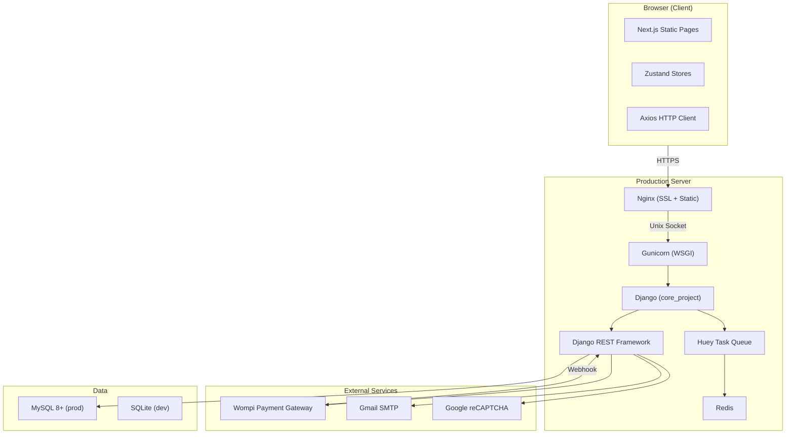
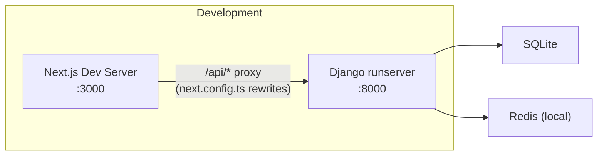
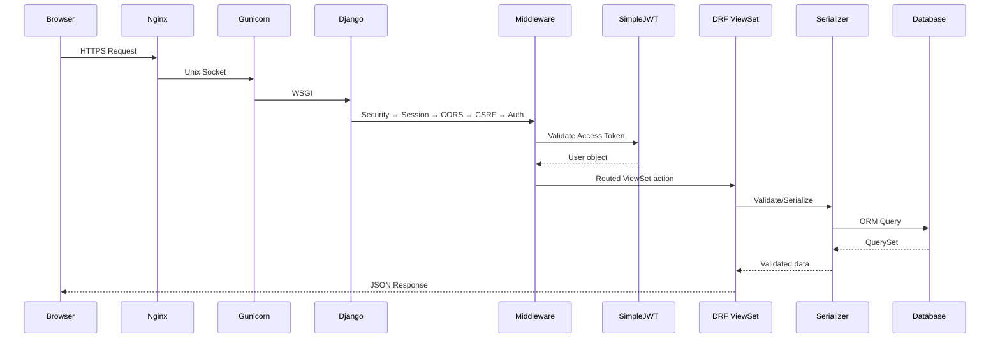
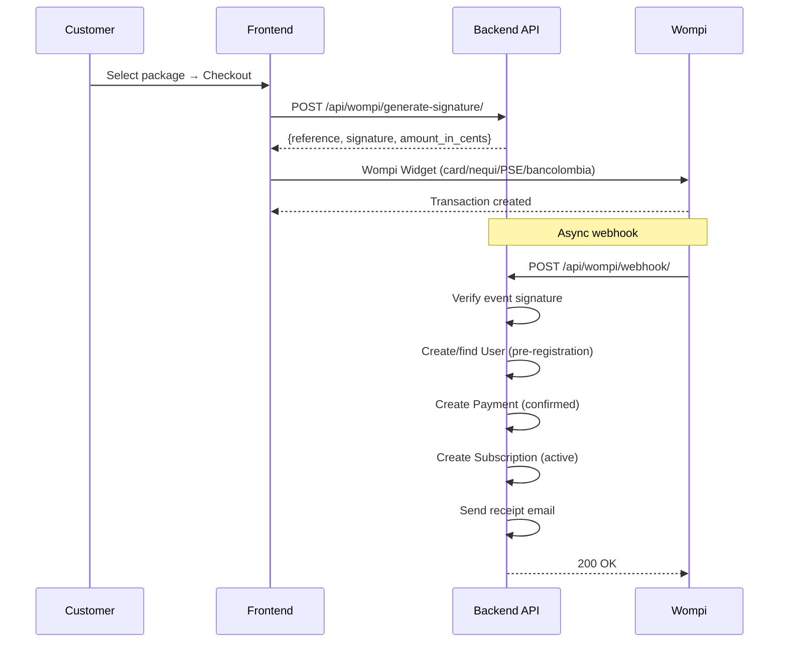
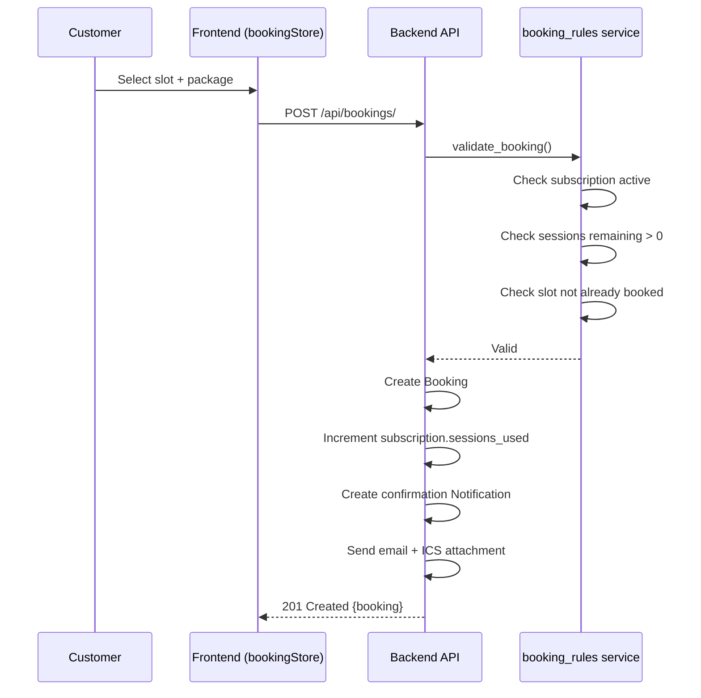
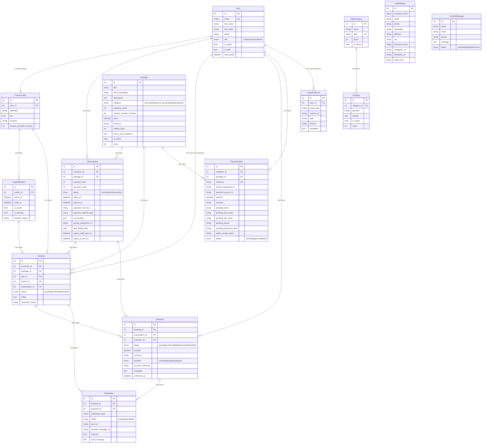
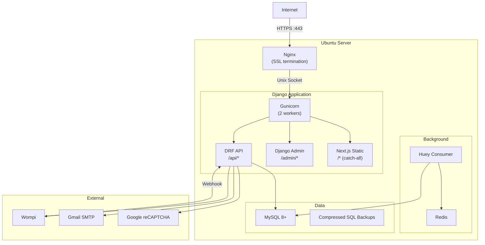

# Architecture Documentation — KÓRE

## 1. System Overview

---

## 2. Development Architecture

In development:
- Next.js runs on port 3000 with API proxy to Django on port 8000
- SQLite database, no MySQL required
- Huey can run in immediate mode (`HUEY_IMMEDIATE=true`) for synchronous task execution

---

## 3. Request Flow

### 3.1 API Request

### 3.2 Payment Flow (Wompi)

### 3.3 Booking Flow

---

## 4. Entity Relationship Diagram

---

## 5. Model Details

| Model | File | Fields | FKs | Key Constraints |
|-------|------|--------|-----|-----------------|
| User | `models/user.py` | 8 | — | email unique, custom AbstractBaseUser |
| TrainerProfile | `models/trainer_profile.py` | 5 | User (1:1) | limit_choices_to role=trainer |
| Package | `models/package.py` | 12 | — | ordering by (order, id) |
| Subscription | `models/subscription.py` | 14 | User, Package | — |
| AvailabilitySlot | `models/availability.py` | 6 | TrainerProfile | ends_at > starts_at check, unique (starts_at, ends_at) |
| Booking | `models/booking.py` | 8 | User, Package, AvailabilitySlot, TrainerProfile, Subscription | — |
| Payment | `models/payment.py` | 10 | Booking, Subscription, User | — |
| PaymentIntent | `models/payment_intent.py` | 14 | User, Package | reference unique |
| Notification | `models/notification.py` | 8 | Booking, Payment | — |
| AnalyticsEvent | `models/analytics.py` | 6 | User (nullable) | — |
| SiteSettings | `models/content.py` | 10 | — | SingletonModel (pk=1) |
| FAQCategory | `models/content.py` | 4 | — | slug unique |
| FAQItem | `models/content.py` | 5 | FAQCategory | — |
| ContactMessage | `models/content.py` | 5 | — | — |

**Total: 14 models** across 12 files (content.py has 4 models).

---

## 6. Service Layer

| Service | File | Responsibility |
|---------|------|---------------|
| `booking_rules` | `services/booking_rules.py` | Validates booking constraints (subscription active, sessions remaining, slot available) |
| `email_service` | `services/email_service.py` | Sends transactional emails (receipts, reminders, booking confirmations) |
| `ics_generator` | `services/ics_generator.py` | Generates ICS calendar files for confirmed bookings |
| `subscription_cleanup` | `services/subscription_cleanup.py` | Expires overdue subscriptions |
| `wompi_service` | `services/wompi_service.py` | Wompi API client (create transactions, generate references, verify signatures) |

---

## 7. Frontend Page Routing

| Route Group | Path | Page | Auth Required |
|-------------|------|------|---------------|
| `(public)` | `/` | Home (landing page) | No |
| `(public)` | `/programs` | Programs listing | No |
| `(public)` | `/checkout` | Payment checkout | No |
| `(public)` | `/login` | Login form | No |
| `(public)` | `/register` | Registration form | No |
| `(public)` | `/faq` | FAQ page | No |
| `(public)` | `/contact` | Contact form | No |
| `(public)` | `/kore-brand` | Brand/about page | No |
| `(public)` | `/terms` | Terms & conditions | No |
| `(app)` | `/dashboard` | Customer dashboard | Yes |
| `(app)` | `/calendar` | Session calendar view | Yes |
| `(app)` | `/book-session` | Book a new session | Yes |
| `(app)` | `/my-programs` | My programs/subscriptions | Yes |
| `(app)` | `/my-programs/program` | Single program detail | Yes |
| `(app)` | `/subscription` | Subscription management | Yes |

**Total: 15 pages** (9 public + 6 authenticated).

---

## 8. Store Architecture (Zustand)

| Store | File | State & Actions |
|-------|------|-----------------|
| `authStore` | `lib/stores/authStore.ts` | User state, login/logout, token management, profile fetch |
| `bookingStore` | `lib/stores/bookingStore.ts` | Slots, bookings CRUD, calendar data, booking creation/cancellation |
| `checkoutStore` | `lib/stores/checkoutStore.ts` | Checkout flow, Wompi config, payment intent creation, signature generation |
| `subscriptionStore` | `lib/stores/subscriptionStore.ts` | Subscriptions list, active subscription, session tracking, expiry reminders |

---

## 9. Async Tasks (Huey)

| Task | Schedule | Description |
|------|----------|-------------|
| `process_recurring_billing` | Daily 08:00 UTC | Charges subscriptions due today via Wompi saved payment sources |
| `send_expiring_subscription_reminders` | Daily 08:00 UTC | Emails reminders for non-recurring subscriptions expiring within 7 days |

---

## 10. Deployment Architecture

### Systemd Services
- `kore_project.service` — Gunicorn WSGI server
- `kore_project.socket` — Unix socket activation
- `kore-huey.service` — Huey task consumer

### Build Process
1. `cd frontend && npm run build` → generates static export in `out/`
2. Build script moves `out/` → `backend/templates/`
3. Django serves static HTML via `serve_nextjs_page` catch-all view
4. `_next/` assets served by Nginx directly (1-year cache)
