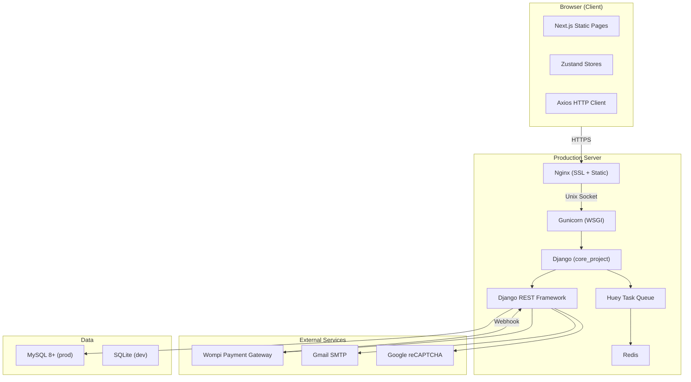
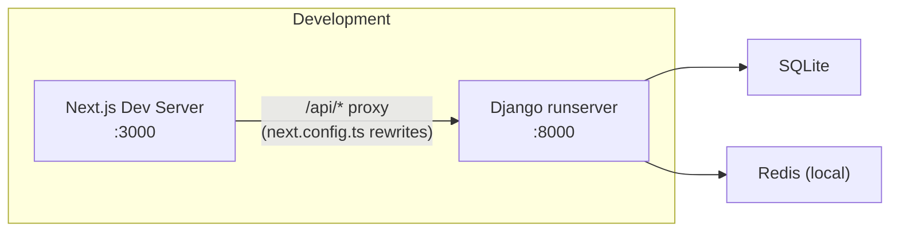
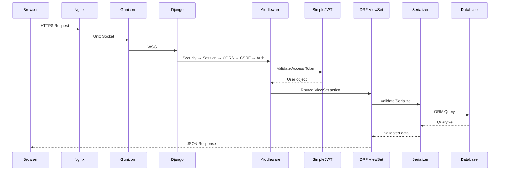
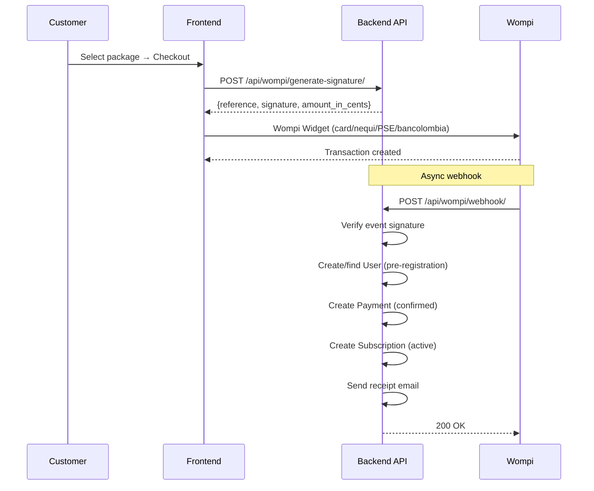
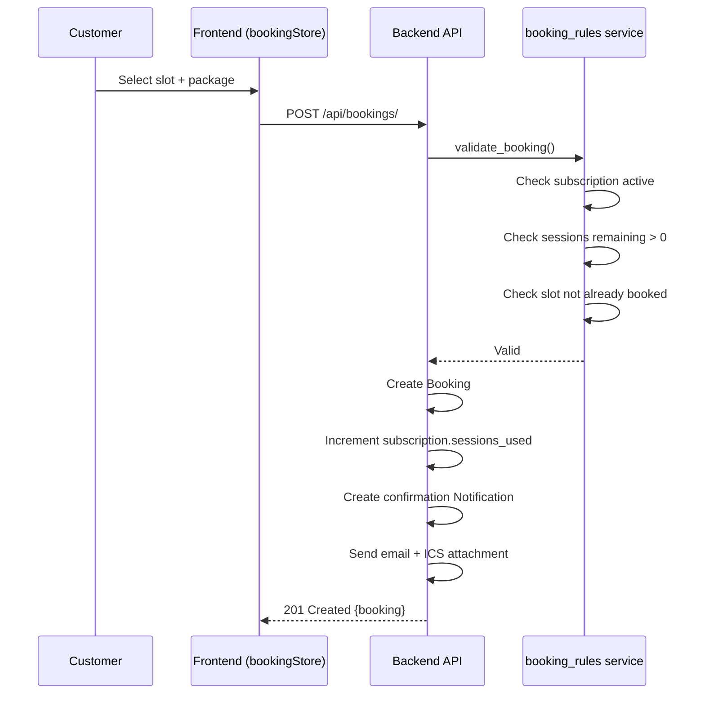
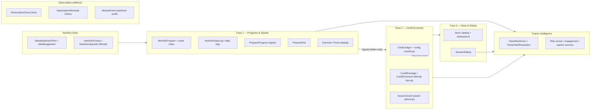
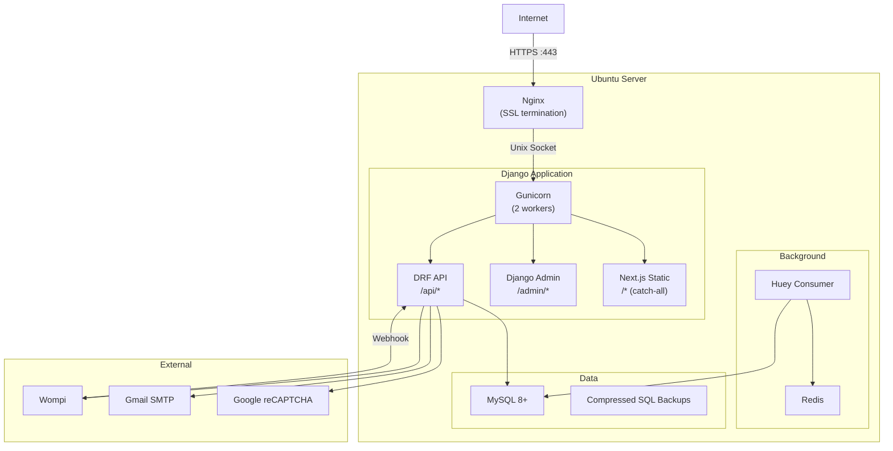

# Architecture Documentation — KÓRE

## 1. System Overview

```mermaid
flowchart TB
    subgraph Client["Browser (Client)"]
        NextJS["Next.js Static Pages"]
        Zustand["Zustand Stores"]
        Axios["Axios HTTP Client"]
    end

    subgraph Server["Production Server"]
        Nginx["Nginx (SSL + Static)"]
        Gunicorn["Gunicorn (WSGI)"]
        Django["Django (core_project)"]
        DRF["Django REST Framework"]
        Huey["Huey Task Queue"]
        Redis["Redis"]
    end

    subgraph External["External Services"]
        Wompi["Wompi Payment Gateway"]
        Gmail["Gmail SMTP"]
        ReCAPTCHA["Google reCAPTCHA"]
    end

    subgraph Storage["Data"]
        MySQL["MySQL 8+ (prod)"]
        SQLite["SQLite (dev)"]
    end

    Client -->|HTTPS| Nginx
    Nginx -->|Unix Socket| Gunicorn
    Gunicorn --> Django
    Django --> DRF
    Django --> Huey
    Huey --> Redis
    DRF --> MySQL
    DRF --> Wompi
    DRF --> Gmail
    DRF --> ReCAPTCHA
    Wompi -->|Webhook| DRF
```

---

## 2. Development Architecture

```mermaid
flowchart LR
    subgraph Dev["Development"]
        FrontendDev["Next.js Dev Server\n:3000"]
        BackendDev["Django runserver\n:8000"]
    end

    FrontendDev -->|"/api/* proxy\n(next.config.ts rewrites)"| BackendDev
    BackendDev --> SQLite3["SQLite"]
    BackendDev --> RedisLocal["Redis (local)"]
```

In development:
- Next.js runs on port 3000 with API proxy to Django on port 8000
- SQLite database, no MySQL required
- Huey can run in immediate mode (`HUEY_IMMEDIATE=true`) for synchronous task execution

---

## 3. Request Flow

### 3.1 API Request

```mermaid
sequenceDiagram
    participant B as Browser
    participant N as Nginx
    participant G as Gunicorn
    participant D as Django
    participant MW as Middleware
    participant JWT as SimpleJWT
    participant V as DRF ViewSet
    participant S as Serializer
    participant DB as Database

    B->>N: HTTPS Request
    N->>G: Unix Socket
    G->>D: WSGI
    D->>MW: Security → Session → CORS → CSRF → Auth
    MW->>JWT: Validate Access Token
    JWT-->>MW: User object
    MW->>V: Routed ViewSet action
    V->>S: Validate/Serialize
    S->>DB: ORM Query
    DB-->>S: QuerySet
    S-->>V: Validated data
    V-->>B: JSON Response
```

### 3.2 Payment Flow (Wompi)

```mermaid
sequenceDiagram
    participant C as Customer
    participant FE as Frontend
    participant BE as Backend API
    participant W as Wompi

    C->>FE: Select package → Checkout
    FE->>BE: POST /api/wompi/generate-signature/
    BE-->>FE: {reference, signature, amount_in_cents}
    FE->>W: Wompi Widget (card/nequi/PSE/bancolombia)
    W-->>FE: Transaction created
    Note over W,BE: Async webhook
    W->>BE: POST /api/wompi/webhook/
    BE->>BE: Verify event signature
    BE->>BE: Create/find User (pre-registration)
    BE->>BE: Create Payment (confirmed)
    BE->>BE: Create Subscription (active)
    BE->>BE: Send receipt email
    BE-->>W: 200 OK
```

### 3.3 Booking Flow

```mermaid
sequenceDiagram
    participant C as Customer
    participant FE as Frontend (bookingStore)
    participant BE as Backend API
    participant Rules as booking_rules service

    C->>FE: Select slot + package
    FE->>BE: POST /api/bookings/
    BE->>Rules: validate_booking()
    Rules->>Rules: Check subscription active
    Rules->>Rules: Check sessions remaining > 0
    Rules->>Rules: Check slot not already booked
    Rules-->>BE: Valid
    BE->>BE: Create Booking
    BE->>BE: Increment subscription.sessions_used
    BE->>BE: Create confirmation Notification
    BE->>BE: Send email + ICS attachment
    BE-->>FE: 201 Created {booking}
```

---

## 4. Entity Relationship Diagram

```mermaid
erDiagram
    User ||--o| TrainerProfile : "1:1 (role=trainer)"
    User ||--o| CustomerProfile : "1:1 (role=customer)"
    User ||--o{ Subscription : "has many"
    User ||--o{ Booking : "has many (as customer)"
    User ||--o{ Payment : "has many"
    User ||--o{ PaymentIntent : "has many"
    User ||--o{ AnalyticsEvent : "has many (optional)"
    User ||--o{ MoodEntry : "has many"
    User ||--o{ WeightEntry : "has many"
    User ||--o{ PasswordResetCode : "has many"
    User ||--o{ TermsAcceptance : "has many"
    User ||--o{ AnthropometryEvaluation : "has many (as customer)"
    User ||--o{ PosturometryEvaluation : "has many (as customer)"
    User ||--o{ PhysicalEvaluation : "has many (as customer)"
    User ||--o{ NutritionHabit : "has many (as customer)"
    User ||--o{ ParqAssessment : "has many (as customer)"

    Package ||--o{ Subscription : "has many"
    Package ||--o{ Booking : "has many"
    Package ||--o{ PaymentIntent : "has many"

    Subscription ||--o{ Booking : "has many"
    Subscription ||--o{ Payment : "has many"

    TrainerProfile ||--o{ AvailabilitySlot : "has many"
    TrainerProfile ||--o{ Booking : "has many"
    TrainerProfile ||--o{ AnthropometryEvaluation : "has many"
    TrainerProfile ||--o{ PosturometryEvaluation : "has many"
    TrainerProfile ||--o{ PhysicalEvaluation : "has many"

    AvailabilitySlot ||--o{ Booking : "has many"

    Booking ||--o{ Payment : "has many"
    Booking ||--o{ Notification : "has many"

    Payment ||--o{ Notification : "has many"

    FAQCategory ||--o{ FAQItem : "has many"

    User {
        int id PK
        string email UK
        string first_name
        string last_name
        string phone
        enum role "customer|trainer|admin"
        bool is_active
        bool is_staff
        datetime date_joined
    }

    TrainerProfile {
        int id PK
        int user_id FK
        string specialty
        text bio
        string location
        int session_duration_minutes
    }

    CustomerProfile {
        int id PK
        int user_id FK
        string avatar
        enum sex "masculino|femenino|otro|prefiero_no_decir"
        date date_of_birth
        string eps
        enum id_type "ti|cc|ce|pasaporte|dni"
        string id_number
        date id_expedition_date
        string address
        string city
        enum primary_goal "fat_loss|muscle_gain|rehab|general_health|sports_performance"
        date kore_start_date
        bool profile_completed
    }

    Package {
        int id PK
        string title
        string short_description
        text description
        enum category "personalizado|semi_personalizado|terapeutico"
        int sessions_count
        int session_duration_minutes
        decimal price
        string currency
        int validity_days
        text terms_and_conditions
        bool is_active
        int order
    }

    Subscription {
        int id PK
        int customer_id FK
        int package_id FK
        int sessions_total
        int sessions_used
        enum status "active|expired|canceled"
        datetime starts_at
        datetime expires_at
        string payment_source_id
        string payment_method_type
        bool is_recurring
        string wompi_transaction_id
        date next_billing_date
        datetime expiry_email_sent_at
        datetime expiry_ui_sent_at
    }

    AvailabilitySlot {
        int id PK
        int trainer_id FK
        datetime starts_at
        datetime ends_at
        bool is_active
        bool is_blocked
        string blocked_reason
    }

    Booking {
        int id PK
        int customer_id FK
        int package_id FK
        int slot_id FK
        int trainer_id FK
        int subscription_id FK
        enum status "pending|confirmed|canceled"
        text notes
        string canceled_reason
    }

    Payment {
        int id PK
        int booking_id FK
        int subscription_id FK
        int customer_id FK
        enum status "pending|confirmed|failed|canceled|refunded"
        decimal amount
        string currency
        enum provider "wompi|payu|epayco|paypal"
        string provider_reference
        json metadata
        datetime confirmed_at
    }

    PaymentIntent {
        int id PK
        int customer_id FK
        int package_id FK
        string reference UK
        string wompi_transaction_id
        string payment_source_id
        decimal amount
        string currency
        string pending_email
        string pending_first_name
        string pending_last_name
        string pending_phone
        string pending_password_hash
        string public_access_token
        enum status "pending|approved|failed"
    }

    Notification {
        int id PK
        int booking_id FK
        int payment_id FK
        enum notification_type
        enum status "pending|sent|failed"
        string sent_to
        string provider_message_id
        json payload
        text error_message
    }

    AnalyticsEvent {
        int id PK
        int user_id FK
        string event_type
        string session_id
        string path
        string referrer
        json metadata
    }

    AnthropometryEvaluation {
        int id PK
        int customer_id FK
        int trainer_id FK
        date evaluation_date
        decimal weight_kg
        decimal height_cm
        decimal waist_cm
        decimal hip_cm
        json perimeters
        json skinfolds
        text notes
        json recommendations
        decimal bmi
        string bmi_category
        decimal waist_hip_ratio
        decimal body_fat_pct
        decimal fat_mass_kg
        decimal lean_mass_kg
        json asymmetries
    }

    PosturometryEvaluation {
        int id PK
        int customer_id FK
        int trainer_id FK
        date evaluation_date
        json anterior_data
        json lateral_right_data
        json lateral_left_data
        json posterior_data
        image anterior_photo
        image lateral_right_photo
        image lateral_left_photo
        image posterior_photo
        text notes
        json recommendations
        decimal global_index
        decimal upper_index
        decimal central_index
        decimal lower_index
        json segment_scores
        json findings
    }

    PhysicalEvaluation {
        int id PK
        int customer_id FK
        int trainer_id FK
        date evaluation_date
        int squats_reps
        int pushups_reps
        int plank_seconds
        int walk_meters
        int unipodal_seconds
        int hip_mobility
        int shoulder_mobility
        int ankle_mobility
        text notes
        json recommendations
        decimal strength_index
        decimal endurance_index
        decimal mobility_index
        decimal balance_index
        decimal general_index
        json cross_module_alerts
    }

    NutritionHabit {
        int id PK
        int customer_id FK
        int meals_per_day
        decimal water_liters
        int fruit_weekly
        int vegetable_weekly
        int protein_frequency
        int ultraprocessed_weekly
        int sugary_drinks_weekly
        bool eats_breakfast
        text notes
        decimal habit_score
        string habit_category
    }

    ParqAssessment {
        int id PK
        int customer_id FK
        bool q1_heart_condition
        bool q2_chest_pain
        bool q3_dizziness
        bool q4_chronic_condition
        bool q5_prescribed_medication
        bool q6_bone_joint_problem
        bool q7_medical_supervision
        text additional_notes
        int yes_count
        string risk_classification
    }

    MoodEntry {
        int id PK
        int user_id FK
        int score
        text notes
        date date
    }

    WeightEntry {
        int id PK
        int user_id FK
        decimal weight_kg
        date date
    }

    PasswordResetCode {
        int id PK
        int user_id FK
        string code
        datetime expires_at
        bool used
    }

    TermsAcceptance {
        int id PK
        int user_id FK
        string terms_version
        string ip_address
        text user_agent
        datetime accepted_at
    }

    SiteSettings {
        int id PK
        string company_name
        string email
        string phone
        string whatsapp
        string address
        string city
        string business_hours
        string instagram_url
        string facebook_url
        string footer_text
    }

    FAQCategory {
        int id PK
        string name
        string slug UK
        int order
        bool is_active
    }

    FAQItem {
        int id PK
        int category_id FK
        string question
        text answer
        bool is_active
        int order
    }

    ContactMessage {
        int id PK
        string name
        string email
        string phone
        text message
        enum status "new|read|replied|archived"
    }
```

### 4.1 Domain map — Fase 1 / Fase 2 additions (April–July 2026)

The ERD above covers the core platform (still accurate). The 2026 releases added ~21 model files across five domains; their high-level data flow:

```mermaid
flowchart LR
    subgraph Fase1["Fase 1 — Programs & Signals"]
        MP["MonthlyProgram + week notes"]
        DL["NutritionDailyLog / daily logs"]
        PP["ProgramProgress signals"]
        PT["PhysicalTest"]
        EX["Exercise / Food catalogs"]
    end

    subgraph Credits["Fase 2 — Credit Economy"]
        CE["Credit ledger + config (credit.py)"]
        CP["CreditPackage / CreditPurchase (Wompi top-up)"]
        SG["SessionGrant (sesión adicional)"]
    end

    subgraph Store["Fase 2 — Store & Rating"]
        ST["Store catalog + redemptions"]
        SR["SessionRating"]
    end

    subgraph Nutrition["Nutrition Suite"]
        WNP["WeeklyNutritionPlan + MealSuggestion"]
        NP["NutritionProduct / NutritionUpgrade (Wompi)"]
    end

    subgraph Intelligence["Trainer Intelligence"]
        TA["ClientRiskScore + TrainerAlertResolution"]
        RS["Risk scores / engagement / reports services"]
    end

    subgraph Subs["Subscription additions"]
        SGst["SubscriptionGuest (duo)"]
        SRen["SubscriptionRenewal history"]
        WE["WompiEvent (webhook audit)"]
    end

    Fase1 -->|"signals (listen-only)"| Credits
    Credits --> Store
    Credits -->|"day close 23:57"| CE
    Fase1 --> Intelligence
    SR --> Intelligence
    Credits --> Intelligence
    Nutrition --> Fase1
```

Design rule: **the credit engine listens to Fase 1 signals — it never modifies Fase 1 code paths.**

---

## 5. Model Details

| Model | File | Fields | FKs | Key Constraints |
|-------|------|--------|-----|-----------------|
| User | `models/user.py` | 8 | — | email unique, custom AbstractBaseUser |
| TrainerProfile | `models/trainer_profile.py` | 5 | User (1:1) | limit_choices_to role=trainer |
| CustomerProfile | `models/customer_profile.py` | 13 | User (1:1) | limit_choices_to role=customer, auto profile_completed |
| Package | `models/package.py` | 12 | — | ordering by (order, id) |
| Subscription | `models/subscription.py` | 14 | User, Package | — |
| AvailabilitySlot | `models/availability.py` | 6 | TrainerProfile | ends_at > starts_at check, unique (starts_at, ends_at) |
| Booking | `models/booking.py` | 8 | User, Package, AvailabilitySlot, TrainerProfile, Subscription | — |
| Payment | `models/payment.py` | 10 | Booking, Subscription, User | — |
| PaymentIntent | `models/payment_intent.py` | 14 | User, Package | reference unique |
| Notification | `models/notification.py` | 8 | Booking, Payment | — |
| AnalyticsEvent | `models/analytics.py` | 6 | User (nullable) | — |
| AnthropometryEvaluation | `models/anthropometry.py` | 30+ | User, TrainerProfile | auto-computed indices on save |
| PosturometryEvaluation | `models/posturometry.py` | 25+ | User, TrainerProfile | 4-view JSON + photos, auto-computed indices |
| PhysicalEvaluation | `models/physical_evaluation.py` | 40+ | User, TrainerProfile | cross-module alerts from anthropometry/posturometry |
| NutritionHabit | `models/nutrition_habit.py` | 12 | User | auto-computed habit_score on save |
| ParqAssessment | `models/parq_assessment.py` | 12 | User | auto-computed risk_classification on save |
| MoodEntry | `models/mood_entry.py` | 4 | User | unique_together (user, date) |
| WeightEntry | `models/weight_entry.py` | 3 | User | unique_together (user, date) |
| PasswordResetCode | `models/password_reset_code.py` | 4 | User | 10-min expiry, single-use |
| RegistrationVerificationCode | `models/registration_verification_code.py` | 4 | User | 6-digit code, single-use, expiry tracking |
| TermsAcceptance | `models/terms_acceptance.py` | 5 | User | unique_together (user, terms_version) |
| SiteSettings | `models/content.py` | 10 | — | SingletonModel (pk=1) |
| FAQCategory | `models/content.py` | 4 | — | slug unique |
| FAQItem | `models/content.py` | 5 | FAQCategory | — |
| ContactMessage | `models/content.py` | 5 | — | — |

The table above details the core-platform models. Later releases added these model files (grouped by domain):

| Domain | Model files |
|--------|-------------|
| Programs (Fase 1) | `monthly_program.py`, `program_week_note.py`, `physical_test.py`, `exercise.py`, `food.py` |
| Nutrition suite | `nutrition_daily_log.py`, `weekly_nutrition_plan.py`, `nutrition_week_note.py`, `meal_suggestion.py`, `nutrition_product.py`, `nutrition_upgrade.py` |
| Credit economy (Fase 2) | `credit.py`, `credit_package.py`, `credit_purchase.py`, `session_grant.py` |
| Store & rating (Fase 2) | `store.py`, `session_rating.py` |
| Trainer intelligence | `trainer_alert.py`, `trainer_alert_resolution.py`, `trainer_message.py`, `trainer_unavailability.py` |
| Subscription additions | `subscription_guest.py`, `subscription_renewal.py`, `wompi_event.py` |

**Total: 63 model classes** across 46 files (verified 2026-07-17; `content.py` holds 4 models, `credit.py` and `store.py` hold several each).

---

## 6. Service Layer

| Service | File | Responsibility |
|---------|------|---------------|
| `booking_rules` | `services/booking_rules.py` | Validates booking constraints (subscription active, sessions remaining, slot available) |
| `email_service` | `services/email_service.py` | Sends transactional emails (receipts, reminders, booking confirmations) |
| `ics_generator` | `services/ics_generator.py` | Generates ICS calendar files for confirmed bookings |
| `subscription_cleanup` | `services/subscription_cleanup.py` | Expires overdue subscriptions |
| `wompi_service` | `services/wompi_service.py` | Wompi API client (create transactions, generate references, verify signatures) |
| `anthropometry_calculator` | `services/anthropometry_calculator.py` | Pure calculation functions: BMI, waist-hip ratio, body fat %, lean mass, asymmetries |
| `posturometry_calculator` | `services/posturometry_calculator.py` | Postural indices from 4-view segment observations (REEDCO/NYPR-based scoring) |
| `physical_evaluation_calculator` | `services/physical_evaluation_calculator.py` | Age/sex-stratified baremo scoring for fitness tests; composite indices; cross-module alerts |
| `nutrition_calculator` | `services/nutrition_calculator.py` | Composite habit score (0–10) from 8 dietary habit variables |
| `parq_calculator` | `services/parq_calculator.py` | PAR-Q+ risk classification from 7 general health questions |
| `kore_index_calculator` | `services/kore_index_calculator.py` | Composite KORE score (0–100) aggregating all diagnostic modules with weighted contributions |
| `slot_schedule` | `services/slot_schedule.py` | Weekly schedule constants and slot-generation helpers for availability management |
| `billing_calendar` | `services/billing_calendar.py` | Billing-cycle date computations |
| `recurring_renewal` | `services/recurring_renewal.py` | Renewal execution for recurring memberships (consumed by `process_recurring_billing`) |
| `renewal_history_service` | `services/renewal_history_service.py` | `SubscriptionRenewal` history writing/reading |
| `admin_subscription_service` | `services/admin_subscription_service.py` | Admin-platform subscription operations |
| `credit_engine` | `services/credit_engine.py` | Credit earn/lose rules, streak bonuses, difficulty configs, ledger writes |
| `credit_day_close` | `services/credit_day_close.py` | Day-close evaluation (no-show penalties, daily credit closure) |
| `program_generator` | `services/program_generator.py` | Monthly program generation |
| `progress_service` | `services/progress_service.py` | Program progress aggregation (Fase 1 signals) |
| `adherence_calculator` | `services/adherence_calculator.py` | Adherence metrics from program/daily-log data |
| `nutrition_access` | `services/nutrition_access.py` | Nutrition plan entitlement/access checks (incl. upgrades) |
| `nutrition_plan_generator` | `services/nutrition_plan_generator.py` | Weekly nutrition plan generation |
| `meal_suggestion_service` | `services/meal_suggestion_service.py` | Meal suggestion composition |
| `clinical_alert_engine` | `services/clinical_alert_engine.py` | Clinical alerts from diagnostic data |
| `behavioral_alert_engine` | `services/behavioral_alert_engine.py` | Behavioral alerts from engagement signals |
| `risk_score_service` | `services/risk_score_service.py` | Composite per-client risk score |
| `trainer_engagement_service` | `services/trainer_engagement_service.py` | Trainer engagement analytics (Parte 11b) |
| `reports_service` | `services/reports_service.py` | Admin Reports/KPIs aggregations (Parte 11a) |

**Total: 29 services.**

---

## 7. Frontend Page Routing

| Route Group | Path | Page | Auth Required |
|-------------|------|------|---------------|
| `(public)` | `/` | Home (landing page) | No |
| `(public)` | `/programs` | Programs listing | No |
| `(public)` | `/checkout` | Payment checkout | No |
| `(public)` | `/login` | Login form | No |
| `(public)` | `/register` | Registration form | No |
| `(public)` | `/faq` | FAQ page | No |
| `(public)` | `/contact` | Contact form | No |
| `(public)` | `/kore-brand` | Brand/about page | No |
| `(public)` | `/terms` | Terms & conditions | No |
| `(public)` | `/forgot-password` | Password reset form | No |
| `(app)` | `/dashboard` | Customer dashboard | Yes |
| `(app)` | `/calendar` | Session calendar view | Yes |
| `(app)` | `/book-session` | Book a new session | Yes |
| `(app)` | `/subscription` | Subscription management | Yes |
| `(app)` | `/profile` | Customer profile management | Yes |
| `(app)` | `/my-diagnosis` | Diagnosis overview (KORE index) | Yes |
| `(app)` | `/my-nutrition` | Nutrition habit entries | Yes |
| `(app)` | `/my-parq` | PAR-Q+ assessments | Yes |
| `(app)` | `/my-physical-evaluation` | Physical evaluation results | Yes |
| `(app)` | `/my-posturometry` | Posturometry results | Yes |
| `(app)` | `/trainer/dashboard` | Trainer dashboard (stats) | Yes (trainer) |
| `(app)` | `/trainer/clients` | Trainer client list | Yes (trainer) |
| `(app)` | `/trainer/clients/client` | Client detail | Yes (trainer) |
| `(app)` | `/trainer/clients/client/anthropometry` | Client anthropometry CRUD | Yes (trainer) |
| `(app)` | `/trainer/clients/client/nutrition` | Client nutrition view | Yes (trainer) |
| `(app)` | `/trainer/clients/client/parq` | Client PAR-Q view | Yes (trainer) |
| `(app)` | `/trainer/clients/client/physical-evaluation` | Client physical eval CRUD | Yes (trainer) |
| `(app)` | `/trainer/clients/client/posturometry` | Client posturometry CRUD | Yes (trainer) |

The table above lists the core routes. Later releases added: customer credits/wallet (`/mis-creditos`, `/comprar-creditos`), store (`/tienda`), program & nutrition daily views, session detail; trainer store management, tareas (`/trainer/tareas`), configuración (`/trainer/configuracion`), metrics; and the `admin-platform/` group (dashboard, users ×3, subscriptions ×3, plans, nutrición, reports).

**Total: 57 pages** (11 public + 35 authenticated `(app)` + 10 `admin-platform` + 1 root-level `change-password-required`).

---

## 8. Store Architecture (Zustand)

| Store | File | State & Actions |
|-------|------|------------------|
| `authStore` | `lib/stores/authStore.ts` | User state, login/logout, token management, profile fetch |
| `bookingStore` | `lib/stores/bookingStore.ts` | Slots, bookings CRUD, calendar data, booking creation/cancellation |
| `checkoutStore` | `lib/stores/checkoutStore.ts` | Checkout flow, Wompi config, payment intent creation, signature generation |
| `subscriptionStore` | `lib/stores/subscriptionStore.ts` | Subscriptions list, active subscription, session tracking, expiry reminders |
| `profileStore` | `lib/stores/profileStore.ts` | Customer profile CRUD, avatar upload, mood check-in, goal selection |
| `anthropometryStore` | `lib/stores/anthropometryStore.ts` | Anthropometry evaluations list, body composition indices |
| `nutritionStore` | `lib/stores/nutritionStore.ts` | Nutrition assessment form data, habit scoring |
| `parqStore` | `lib/stores/parqStore.ts` | PAR-Q questionnaire responses, risk assessment |
| `physicalEvaluationStore` | `lib/stores/physicalEvaluationStore.ts` | Physical evaluation results, fitness indicators |
| `posturometryStore` | `lib/stores/posturometryStore.ts` | Posturometry evaluations, regional postural analysis |
| `pendingAssessmentsStore` | `lib/stores/pendingAssessmentsStore.ts` | KORE score, pending assessment module tracking |
| `trainerStore` | `lib/stores/trainerStore.ts` | Trainer dashboard stats, client list, client detail, client sessions |
| `programStore` | `lib/stores/programStore.ts` | Monthly program data, weekly structure, exercise detail |
| `progressStore` | `lib/stores/progressStore.ts` | Program progress / adherence signals |
| `physicalTestStore` | `lib/stores/physicalTestStore.ts` | Physical test records |
| `nutritionDailyStore` | `lib/stores/nutritionDailyStore.ts` | Daily nutrition logs (meals, habits) |
| `nutritionUpgradeStore` | `lib/stores/nutritionUpgradeStore.ts` | Nutrition plan upgrade purchase flow |
| `walletStore` | `lib/stores/walletStore.ts` | Credit balance, streak, transaction history |
| `creditPurchaseStore` | `lib/stores/creditPurchaseStore.ts` | Buy-credits (Wompi top-up) flow |
| `creditValuesStore` | `lib/stores/creditValuesStore.ts` | Per-action credit value configuration |
| `storeStore` | `lib/stores/storeStore.ts` | Internal store catalog + redemptions |
| `sessionRatingStore` | `lib/stores/sessionRatingStore.ts` | Post-session rating prompt + submissions |
| `trainerSettingsStore` | `lib/stores/trainerSettingsStore.ts` | Trainer difficulty/reschedule-window settings + simulator |
| `trainerTasksStore` | `lib/stores/trainerTasksStore.ts` | Trainer pending-task hub |
| `trainerEngagementStore` | `lib/stores/trainerEngagementStore.ts` | Trainer engagement analytics |
| `adminUserStore` | `lib/stores/adminUserStore.ts` | Admin platform: users CRUD |
| `adminSubscriptionStore` | `lib/stores/adminSubscriptionStore.ts` | Admin platform: subscriptions CRUD |
| `adminPackageStore` | `lib/stores/adminPackageStore.ts` | Admin platform: plans/packages |
| `adminNutritionStore` | `lib/stores/adminNutritionStore.ts` | Admin platform: nutrition management |
| `adminReportsStore` | `lib/stores/adminReportsStore.ts` | Admin platform: Reports/KPIs |

**Total: 30 stores.**

---

## 9. Async Tasks (Huey) — 11 tasks (verified 2026-07-17)

| Task | Schedule | Description |
|------|----------|-------------|
| `process_recurring_billing` | Daily 08:00 UTC | Charges subscriptions due today via Wompi saved payment sources |
| `send_expiring_subscription_reminders` | Daily 08:00 UTC | Emails reminders for non-recurring subscriptions expiring within 7 days |
| `auto_complete_past_bookings` | Every 15 min | Marks past bookings as completed |
| `send_nutrition_reminders` | Mondays 09:00 UTC | Weekly nutrition reminder emails |
| `send_parq_reminders` | Day 1 of month, 09:00 UTC | Monthly PAR-Q renewal reminders |
| `close_daily_logs` | Daily 23:55 UTC | Closes open daily logs; feeds no-show detection |
| `close_credits_day` | Daily 23:57 UTC | Credit-economy day close (applies penalties/bonuses) |
| `complete_finished_programs` | Daily 00:00 UTC | Completes programs past their end date |
| `compute_daily_alerts` | Daily 06:00 UTC | Runs clinical/behavioral alert engines |
| `recompute_risk_score_task` | On-demand (`@db_task`) | Recomputes a customer's risk score |
| `process_credit_event` | On-demand (`@db_task`) | Processes a single credit-earning/losing event |

---

## 10. Deployment Architecture

```mermaid
flowchart TB
    Internet["Internet"]
    Internet -->|HTTPS :443| Nginx

    subgraph Server["Ubuntu Server"]
        Nginx["Nginx\n(SSL termination)"]
        
        subgraph Django["Django Application"]
            Gunicorn["Gunicorn\n(2 workers)"]
            API["DRF API\n/api/*"]
            Admin["Django Admin\n/admin/*"]
            NextPages["Next.js Static\n/* (catch-all)"]
        end

        subgraph Background["Background"]
            HueyWorker["Huey Consumer"]
            RedisServer["Redis"]
        end

        subgraph Data["Data"]
            MySQLDB["MySQL 8+"]
            Backups["Compressed SQL Backups"]
        end

        Nginx -->|Unix Socket| Gunicorn
        Gunicorn --> API
        Gunicorn --> Admin
        Gunicorn --> NextPages
        HueyWorker --> RedisServer
        API --> MySQLDB
        HueyWorker --> MySQLDB
    end

    subgraph External["External"]
        WompiGW["Wompi"]
        GmailSMTP["Gmail SMTP"]
        Captcha["Google reCAPTCHA"]
    end

    API --> WompiGW
    API --> GmailSMTP
    API --> Captcha
    WompiGW -->|Webhook| API
```

### Systemd Services
- `kore_project.service` — Gunicorn WSGI server
- `kore_project.socket` — Unix socket activation
- `kore-huey.service` — Huey task consumer

### Build Process
1. `cd frontend && npm run build` → generates static export in `out/`
2. Build script moves `out/` → `backend/templates/`
3. Django serves static HTML via `serve_nextjs_page` catch-all view
4. `_next/` assets served by Nginx directly (1-year cache)
